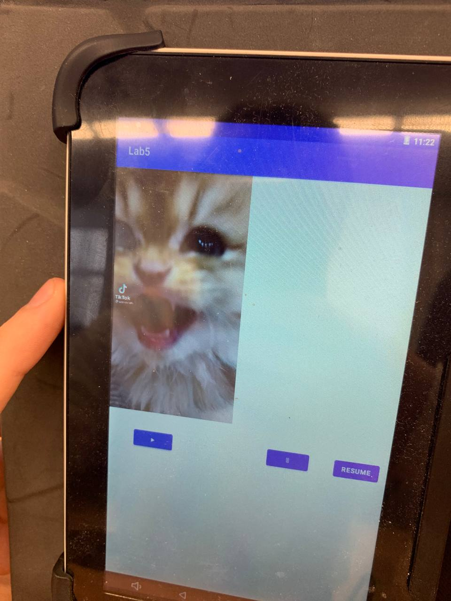
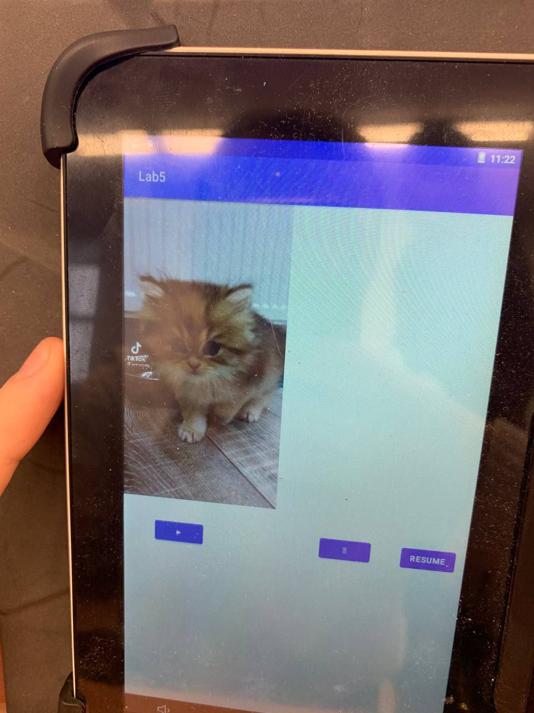
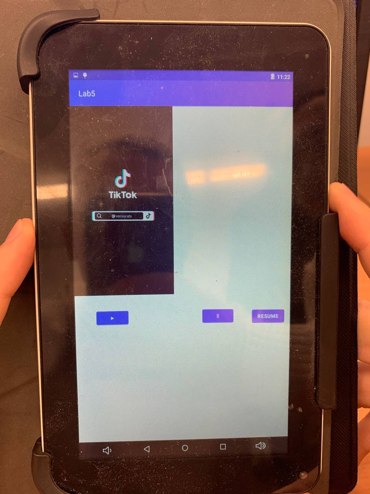

# Lab5lab
Лабораторная работа Иванов Илья и Демин Иван 803б2
На videView положили гифку с котиком из тиктока. Создали 3 кнопки, кнопка запуска видео, кнопка паузы и рестарта видео. Кнопка старт запускает видео, кнопка паузы останавливает его, при нажатии кнопки рестарт требуется дополнительное нажатие кнопки старт, чтоб видео запустилось заново.

